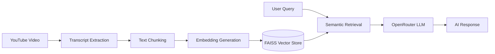

# YouTube Agentic-RAG Chatbot

An AI-powered conversational assistant that allows users to interact with YouTube videos Retrieval-Augmented Generation (RAG).

This project extracts transcripts from YouTube videos, converts them into embeddings, stores them in a FAISS vector database, retrieves relevant context, and generates responses using an open source LLM through OpenRouter.

---

## Features

- YouTube transcript extraction
- Semantic search over video using FAISS vector database
- Retrieval-Augmented Generation (RAG) pipeline
- Conversational memoery powered by LangGraph
- Multi-turn question answering
- OpenRouter LLM integration
- Modular Python project structure
- Streamlit-based interface

---

## 🛠️ Technology Stack

| Category | Technologies |
|-----------|-------------|
| AI Frameworks | LangChain, LangGraph |
| LLM Provider | OpenRouter |
| Language Model | GPT-OSS-120B |
| Embeddings | BAAI/bge-large-en-v1.5 |
| Vector Database | FAISS |
| Frontend | Streamlit |
| Backend | Python |
| Supporting Tools | Hugging Face, YouTube Transcript API, python-dotenv |
---

## Project Structure

```bash
youtube-rag-chatbot/
│
├── app/
│   ├── __init__.py
│   ├── config.py
│   ├── main.py
│   ├── prompts.py
│   ├── rag_pipeline.py
│   ├── transcript.py
│   └── utils.py
│
├── streamlit_app.py
├── requirements.txt
├── .gitignore
├── README.md
└── .env
```

---

## Installation

### 1. Clone the Repository

```bash
git clone https://github.com/YOUR_USERNAME/youtube-rag-chatbot.git

cd youtube-rag-chatbot
```

---

### 2. Create Virtual Environment

#### Windows

```bash
python -m venv venv
venv\Scripts\activate
```

---

### 3. Install Dependencies

```bash
pip install -r requirements.txt
```

---

### 4. Configure Environment Variables

Create a `.env` file in the root directory.

```env
OPENROUTER_API_KEY=your_api_key_here
```

---

## Running the Project

### Terminal Version

```bash
python -m app.main
```

---

### Streamlit Version

```bash
streamlit run streamlit_app.py
```

---

## System Architecture




## Example Questions

- Summarize the video
- What did the speaker say about {Topic}?
- What are the key takeaways from the video?

---

## Future Improvements

- Source citations for responses
- Timestamp-aware retrieval
- Multi-video knowledge base
- MCP (Model Context Protocol) integration
- Agentic tool calling
- Quiz generation from videos
- Exportable notes and summaries

---

## Author

Mohit Trivedi, student at IIT Roorkee.