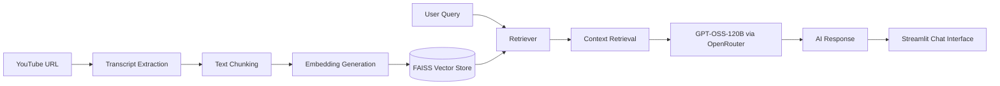

# YouTube RAG Chatbot

An AI-powered Retrieval-Augmented Generation (RAG) chatbot that answers questions about YouTube videos using transcript-based semantic search.

This project extracts transcripts from YouTube videos, converts them into embeddings, stores them in a FAISS vector database, retrieves relevant context, and generates responses using an open source LLM through OpenRouter.

---

## Features

- Extracts transcripts directly from YouTube videos
- Intelligent text chunking using LangChain
- Semantic search with FAISS vector database
- Retrieval-Augmented Generation (RAG)
- Powered by GPT-OSS-120B through OpenRouter
- Interactive Streamlit chat interface
- Starter prompts for quick exploration
- Dark-themed modern UI
- Persistent chat history during session

---

## Tech Stack

### AI / LLM Frameworks
- LangChain
- LangGraph (in progress)

### Language Models
- OpenRouter
- GPT-OSS-120B

### Embeddings
- BAAI/bge-large-en-v1.5

### Vector Database
- FAISS

### Frontend
- Streamlit

### Backend
- Python

### Supporting Libraries
- Hugging Face
- python-dotenv
- YouTube Transcript API

---

## Architecture Diagram



---

## Project Structure

```bash
youtube-rag-chatbot/
│
├── app/
│   ├── __init__.py
│   ├── config.py
│   ├── main.py
│   ├── prompts.py
│   ├── rag_pipeline.py
│   ├── transcript.py
│   └── utils.py
│
├── streamlit_app.py
├── requirements.txt
├── .gitignore
├── README.md
└── .env
```

---

## Installation

### 1. Clone the Repository

```bash
git clone https://github.com/YOUR_USERNAME/youtube-rag-chatbot.git

cd youtube-rag-chatbot
```

---

### 2. Create Virtual Environment

#### Windows

```bash
python -m venv venv
venv\Scripts\activate
```

---

### 3. Install Dependencies

```bash
pip install -r requirements.txt
```

---

### 4. Configure Environment Variables

Create a `.env` file in the root directory.

```env
OPENROUTER_API_KEY=your_api_key_here
```

---

## Running the Project

### Terminal Version

```bash
python -m app.main
```

---

### Streamlit Version

```bash
streamlit run streamlit_app.py
```

---

## System Architecture

```text
YouTube URL
↓
Transcript Processing
↓
Chunking
↓
BAAI Embeddings
↓
FAISS Vector Store
↓
Retrieval
↓
GPT-OSS-120B
↓
Chat Interface
↓
Starter Prompts
↓
Conversational Experience
```

---

## Example Questions

- What is MCP?
- Summarize the video
- What did the speaker say about Tiny LLMs?
- What are the key takeaways from the video?

---

## Future Improvements

- Timestamp-based retrieval
- Chat history
- Multi-video support
- Improved UI/UX
- Retrieval caching
- Source citations

---

## Author

Mohit Trivedi, student at IIT Roorkee.